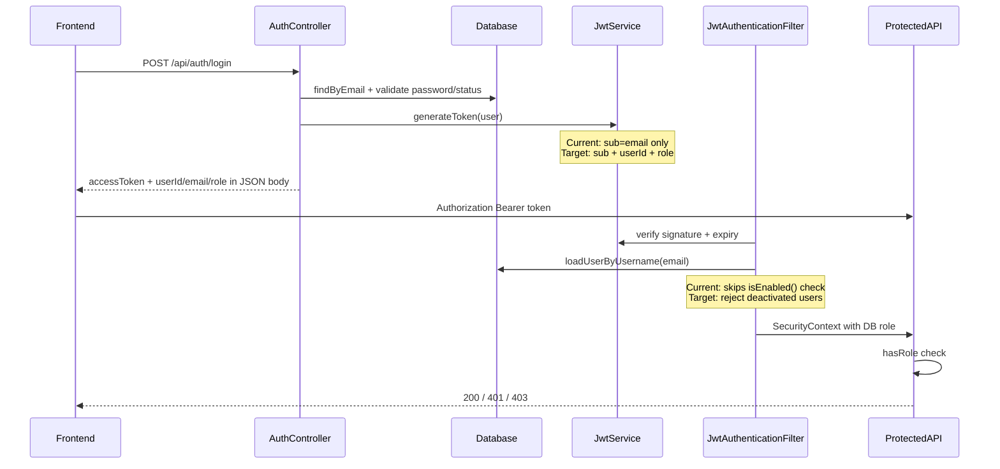

# Auth, User Management & Fuel — Security Audit

Scope: **only** user authentication, user management, and fuel management. Other modules (vehicles, trips, DSM, etc.) are noted only where they affect these three.

---

## Target architecture vs current state

| Requirement                                | Status                    | Evidence                                                                                                                                                                                        |
| ------------------------------------------ | ------------------------- | ----------------------------------------------------------------------------------------------------------------------------------------------------------------------------------------------- |
| Backend fetches user from DB at login      | **Pass**                  | `[AuthService.login()](backend/src/main/java/com/vfms/auth/service/AuthService.java)`                                                                                                           |
| JWT includes userId, email, role           | **Fail**                  | `[JwtService.generateToken()](backend/src/main/java/com/vfms/security/JwtService.java)` — only `sub` (email), `iat`, `exp`                                                                      |
| No password/hash in token                  | **Pass**                  | Claims contain no sensitive fields                                                                                                                                                              |
| Frontend role for UI only                  | **Mostly pass**           | `[RoleGuard](frontend/src/components/auth/role-guard.tsx)` on `/admin/*`, `/dashboards/*`; API uses Bearer token via `[lib/api.ts](frontend/src/lib/api.ts)`                                    |
| All permission checks on backend           | **Pass** (scoped modules) | `/api/admin/`** + `/api/v1/fuel/**` require `ROLE_ADMIN`                                                                                                                                        |
| Every protected route verifies JWT         | **Pass** (scoped modules) | `[SecurityConfig](backend/src/main/java/com/vfms/security/SecurityConfig.java)` lines 76–78                                                                                                     |
| 401 no/invalid/expired token               | **Partial**               | Spring defaults on secured routes; invalid JWT in filter **silently continues** (`[JwtAuthenticationFilter](backend/src/main/java/com/vfms/security/JwtAuthenticationFilter.java)` lines 55–60) |
| 403 wrong role                             | **Pass** (scoped modules) | `hasRole("ADMIN")` on admin + fuel                                                                                                                                                              |
| DB role as source of truth                 | **Partial**               | Role reloaded from DB each request via filter; **not embedded in JWT**; deactivated users still pass filter                                                                                     |
| Short access token (~1 hour)               | **Fail**                  | `[application-dev.properties](backend/src/main/resources/application-dev.properties)`: `86400000` ms = **24 hours**                                                                             |
| Re-check role from DB for critical actions | **Partial**               | Per-request DB reload covers role changes; **no extra check** in `AdminUserService` mutations; refresh re-validates status                                                                      |

---

## Module 1: User Authentication

### What works well

- Login loads user from DB, validates password via `AuthenticationManager`, blocks unverified/pending/deleted users via `validateLoginStatus()`.
- Refresh token is opaque (DB-stored UUID), rotated on refresh, re-runs `validateLoginStatus()` — strong pattern in `[RefreshTokenService](backend/src/main/java/com/vfms/auth/service/RefreshTokenService.java)`.
- Public registration **cannot** escalate role — server forces `SYSTEM_USER` (`[AuthService.register()](backend/src/main/java/com/vfms/auth/service/AuthService.java)`).
- Password reset avoids email enumeration.
- Soft-deleted users excluded from `[CustomUserDetailsService](backend/src/main/java/com/vfms/security/CustomUserDetailsService.java)`.

### Issues (priority order)

**Critical**

1. **JWT missing `userId` and `role` claims** — Your spec requires these in the token payload. Today they appear only in the login JSON response (`AuthResponse`), not in the JWT. Frontend cannot decode role from token without calling the API.
2. **Deactivated users keep API access until token expires** — `[JwtAuthenticationFilter](backend/src/main/java/com/vfms/security/JwtAuthenticationFilter.java)` calls `isTokenValid()` (email + expiry only) but never checks `userDetails.isEnabled()` or `isAccountNonLocked()`. `[User.isEnabled()](backend/src/main/java/com/vfms/user/entity/User.java)` returns false for non-`APPROVED` status, but this is ignored. Admin deactivation does not revoke refresh tokens.
3. **DataSeeder resets known passwords on every boot** — `[DataSeeder.seedTeamUsers()](backend/src/main/java/com/vfms/config/DataSeeder.java)` always runs and overwrites passwords (e.g. `kiruthiyan8@gmail.com` / `Admin@1234`). Critical in any shared or production-like environment.

**High**

1. **Access token lifetime is 24h, not ~1h** — Change `application.security.jwt.expiration` to `3600000` (1 hour).
2. **No access-token revocation on logout** — Logout only clears refresh tokens; stolen access JWT remains valid until expiry.
3. **Invalid JWT handling is silent** — Malformed tokens pass through the filter; secured routes eventually 401, but there is no consistent error body and no early rejection.

**Medium**

1. **No custom `AuthenticationEntryPoint` / `AccessDeniedHandler`** — 401/403 responses may differ from `[GlobalExceptionHandler](backend/src/main/java/com/vfms/common/exception/GlobalExceptionHandler.java)` JSON shape used elsewhere.
2. `**/api/staff-profile/**` relies on `@PreAuthorize` only** — HTTP matcher falls through to legacy `permitAll` (user-mgmt adjacent, not fuel).

### Recommended fixes (auth)

| #   | Change                                                                                                                                   | Files                                        |
| --- | ---------------------------------------------------------------------------------------------------------------------------------------- | -------------------------------------------- |
| A1  | Add JWT claims: `userId` (UUID string), `role` (enum name), keep `sub` = email                                                           | `JwtService`, `AuthService`                  |
| A2  | Add `extractUserId()`, `extractRole()` helpers; keep validation DB-first                                                                 | `JwtService`                                 |
| A3  | In filter: after `loadUserByUsername`, reject if `!isEnabled()` or `!isAccountNonLocked()` — clear context, optionally short-circuit 401 | `JwtAuthenticationFilter`                    |
| A4  | Set access token expiry to 1h (`3600000`); keep refresh at 7d                                                                            | `application-dev.properties`, `.env.example` |
| A5  | On deactivate/soft-delete/role demotion: revoke refresh tokens via `RefreshTokenService`                                                 | `AdminUserService`                           |
| A6  | Gate `DataSeeder.seedTeamUsers()` behind `spring.profiles.active=dev` + explicit flag; never reset passwords in prod                     | `DataSeeder`                                 |
| A7  | Add `AuthenticationEntryPoint` + `AccessDeniedHandler` returning unified `ErrorResponse` JSON                                            | `SecurityConfig` + new handlers              |
| A8  | Optional: `tokenVersion` on `User` checked in filter for instant revocation                                                              | `User` entity, `JwtService`, filter          |

---

## Module 2: User Management

### What works well

- **Defense in depth:** `[SecurityConfig](backend/src/main/java/com/vfms/security/SecurityConfig.java)` `hasRole("ADMIN")` on `/api/admin/`** **plus** class-level `@PreAuthorize` on `[AdminUserController](backend/src/main/java/com/vfms/admin/controller/AdminUserController.java)`.
- Admin create/update/review/delete/toggle all go through `[AdminUserService](backend/src/main/java/com/vfms/admin/service/AdminUserService.java)` with business validation.
- Staff provisioning cross-checks employee registry.
- Frontend admin API client (`[lib/api/admin.ts](frontend/src/lib/api/admin.ts)`) sends JWT only — does not send role for authorization.

### Endpoint protection (user management)

| Area                  | Path prefix                     | Backend enforcement                                       |
| --------------------- | ------------------------------- | --------------------------------------------------------- |
| Admin CRUD            | `/api/admin/users/`**           | JWT + `ROLE_ADMIN` (URL + method)                         |
| Profile               | `/api/user/me`, change-password | JWT `authenticated()`                                     |
| Staff self-profile    | `/api/staff-profile/**`         | JWT optional at HTTP layer; `@PreAuthorize` on controller |
| Auth (register/login) | `/api/auth/**`                  | Public (by design)                                        |

### Issues

**High**

1. **Any ADMIN can create/promote another ADMIN** — No guard on `role == ADMIN` in create/update/review. Risk of privilege sprawl.
2. **No last-admin / self-modify protection** — Admin can deactivate, soft-delete, or demote themselves; no check for last remaining ADMIN.
3. **Frontend role can go stale** — `[auth-store.ts](frontend/src/store/auth-store.ts)` persists role at login; `[getMeApi()](frontend/src/lib/api/auth.ts)` exists but is **not** called on app bootstrap to resync role/status from server.
4. **Demo role switcher defaults to ADMIN** — `[role-context.tsx](frontend/src/lib/role-context.tsx)` uses `demo_role` in localStorage. Labeled testing-only but risky if left in production builds.

**Medium**

1. **Staff self-registration auto-approved** after email verify (`SYSTEM_USER` → `APPROVED`) — no admin review step.
2. **Staff email-check endpoint** may leak whether an email exists in registry.
3. **No MVC security tests** for admin endpoints (401/403 matrix) — only unit tests in `AdminUserServiceTest`.

### Recommended fixes (user management)

| #   | Change                                                                                                              | Files                                  |
| --- | ------------------------------------------------------------------------------------------------------------------- | -------------------------------------- |
| U1  | Block promoting/creating ADMIN without explicit policy (e.g. require `createdByAdmin` audit + optional config flag) | `AdminUserService`                     |
| U2  | Guard: cannot deactivate/delete/demote last ADMIN; block self-demotion/self-delete                                  | `AdminUserService`                     |
| U3  | Revoke refresh tokens on deactivate/soft-delete (ties to A5)                                                        | `AdminUserService`                     |
| U4  | Frontend: call `getMeApi()` on hydrate/refresh to sync role from server                                             | auth store / app layout                |
| U5  | Remove or dev-gate `RoleSwitcher` / `demo_role`                                                                     | `role-context.tsx`, `RoleSwitcher.tsx` |
| U6  | Move `/api/staff-profile/`** to `authenticated()` in SecurityConfig                                                 | `SecurityConfig`                       |
| U7  | Add `AdminUserControllerSecurityTest` (401 unauth, 403 DRIVER, 200 ADMIN)                                           | new test class                         |

---

## Module 3: Fuel Management

### What works well

- **All 16 `/api/v1/fuel/`** endpoints** require JWT + `ROLE_ADMIN` — double-enforced in `[SecurityConfig](backend/src/main/java/com/vfms/security/SecurityConfig.java)` and `[FuelController](backend/src/main/java/com/vfms/fuel/controller/FuelController.java)`.
- Non-admin with valid JWT gets **403**; unauthenticated gets **401**.
- Primary fuel UI at `/admin/fuel/*` protected by `[RoleGuard](frontend/src/components/auth/role-guard.tsx)` in `[admin/layout.tsx](frontend/src/app/admin/layout.tsx)`; data via `[lib/api/fuel.ts](frontend/src/lib/api/fuel.ts)` with JWT interceptor.
- Recent integrity fixes: V18 driver FK (`[V18__fuel_records_driver_fk.sql](backend/src/main/resources/db/migration/V18__fuel_records_driver_fk.sql)`), `@NotFound(IGNORE)`, `resolveDriverFields()` in `[FuelService](backend/src/main/java/com/vfms/fuel/service/FuelService.java)`.

### Endpoint protection matrix (fuel)

All paths below: **JWT required + ADMIN only**.

- `POST/GET /api/v1/fuel`, `GET /metadata`, `GET /{id}`, `GET /{id}/with-vehicle-data`
- `GET /realtime/all`, `GET /search`, `GET /vehicle/{id}`, `GET /vehicle/{id}/realtime`
- `GET /driver/{id}`, `GET /flagged`
- `PUT/PATCH/DELETE /{id}`, `PATCH /{id}/flag`, `PATCH /{id}/unflag`

### Issues

**High**

1. **Legacy fuel reports bypass secured API** — `[reportService.getFuelLogs()](frontend/src/services/reportService.ts)` calls `GET /api/fuel/logs` with raw `axios` (no JWT), hardcoded base URL. Endpoint **does not exist** in current backend. If re-added under legacy `permitAll`, fuel data would be public.
2. `**/dashboard/admin/`** has no RoleGuard** — `[dashboard/admin/layout.tsx](frontend/src/app/dashboard/admin/layout.tsx)` is sidebar-only. Non-admins can open fuel-management and fuel report pages (UI leak; API still 403).

**Medium**

1. **No negative security tests** — `[FuelControllerMvcTest](backend/src/test/java/com/vfms/fuel/controller/FuelControllerMvcTest.java)` only tests ADMIN happy path.
2. **Receipt upload lacks size/MIME validation** — `[FuelStorageService](backend/src/main/java/com/vfms/fuel/service/FuelStorageService.java)`.
3. **Search date params** — `LocalDate.parse()` on raw query strings can 500 on bad input.
4. **Odometer can be set backward** vs vehicle master reading on create/update.
5. `**@NotFound(IGNORE)` redundant post-FK** — silently hides data quality issues if FK is ever bypassed.

**Low**

1. PATCH cannot clear `driverId` (PUT can).
2. Delete does not remove Supabase receipt object.
3. No vehicle FK migration (driver FK only in V18).

### Recommended fixes (fuel)

| #   | Change                                                                                                                | Files                                 |
| --- | --------------------------------------------------------------------------------------------------------------------- | ------------------------------------- |
| F1  | Replace `reportService.getFuelLogs()` with `getAllFuelRecordsApi()` / `searchFuelRecordsApi()` from `lib/api/fuel.ts` | `reportService.ts`, fuel report pages |
| F2  | Add `RoleGuard allowedRole="ADMIN"` to `dashboard/admin/layout.tsx` or redirect to `/admin/fuel`                      | frontend layout                       |
| F3  | Add 401/403 tests to `FuelControllerMvcTest`                                                                          | test class                            |
| F4  | Validate search `from`/`to` dates → 400                                                                               | `FuelController` or DTO               |
| F5  | Receipt: max size, allowed MIME, sanitize filename                                                                    | `FuelStorageService`                  |
| F6  | Optional: odometer >= vehicle current reading on create/update                                                        | `FuelService`                         |

---

## Scorecard (scoped modules only)

| Area                | Backend auth | Frontend UI | Overall                                                 |
| ------------------- | ------------ | ----------- | ------------------------------------------------------- |
| User authentication | 6/10         | 7/10        | Gaps in JWT claims, expiry, deactivated-token handling  |
| User management     | 8/10         | 6/10        | Strong API gates; weak lifecycle guards + stale UI role |
| Fuel management     | 9/10         | 7/10        | API solid; legacy frontend routes are the weak link     |

---

## Suggested implementation phases

**Phase 1 — JWT hardening (auth requirement alignment)**

- A1–A4, A7: claims in token, 1h expiry, filter account-status check, unified 401/403 responses

**Phase 2 — User lifecycle security**

- A5, A6, U1–U3, U6: token revocation, seeder gating, admin guards, staff-profile matcher

**Phase 3 — Fuel frontend cleanup**

- F1, F2: wire legacy reports to `/api/v1/fuel`, guard dashboard admin routes

**Phase 4 — Tests & polish**

- U7, F3–F5: security test matrix, fuel validation, frontend `getMeApi` sync (U4)

---

## Out of scope (per your request)

- Securing legacy `/api/`** modules (vehicles, trips, maintenance, DSM, reports) — documented in `SecurityConfig.REMAINING_OPEN_API_RISK` but not audited here.
- `X-User-Id` header trust on open DSM endpoints — not part of the three modules.

